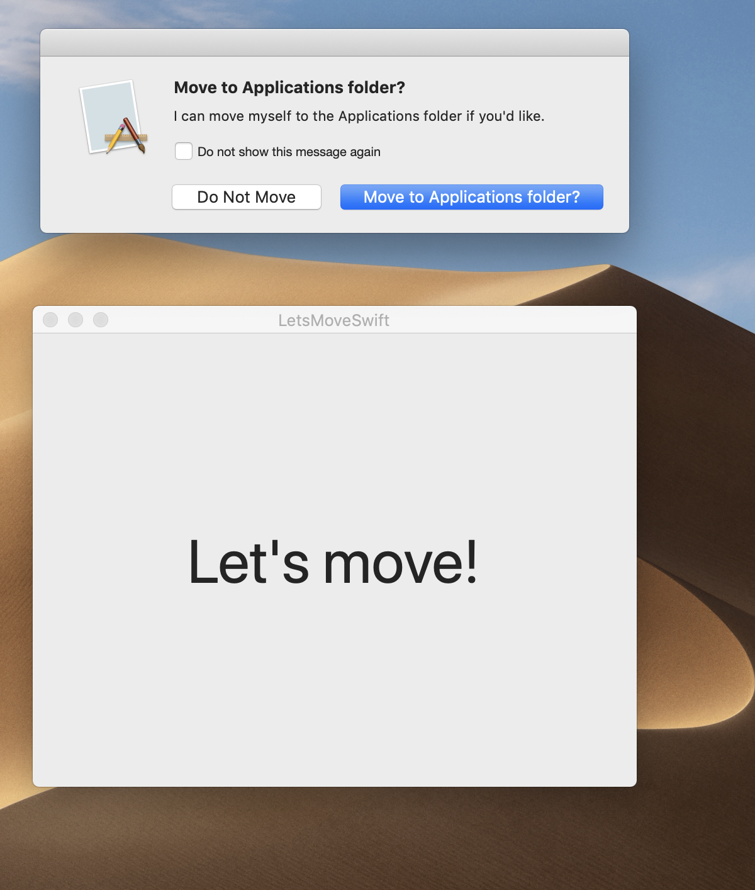

LetsMove
========

A sample project that demonstrates how to move a running Mac OS X application to the Applications folder.

<em>A skeleton app showing LetsMeMove in action</em>

# Update

A Objective C version available [LetsMove](https://github.com/potionfactory/LetsMove) by [potionfactory](https://github.com/potionfactory)

Requirements
------------
Builds and runs on Mac OS X 10.14 or higher. Does NOT support sandboxed applications.

Usage
-----

Option 1:

Build then embed LetsMove.framework into your app.

Option 2:

Copy the following files into your project:

- MoveApplication.strings
- MoveApplication.swift

If your application is localized, also copy the 'MoveApplication.string' files into your project.

Link your application against Security.framework.

In your app delegate's "applicationWillFinishLaunching" method, call the MoveToApplicationsFolderIfNecessary function at the very top.

License
-------
Public domain

Code Contributors:
-------------
* Andy Kim
* John Brayton
* Chad Sellers
* Kevin LaCoste
* Rasmus Andersson
* Timothy J. Wood
* Matt Gallagher
* Whitney Young
* Nick Moore
* Nicholas Riley
* Matt Prowse
* Maxim Ananov
* Charlie Stigler

Translators:
------------
* Eita Hayashi (Japanese)
* Gleb M. Borisov, Maxim Ananov (Russian)
* Wouter Broekhof (Dutch)
* Rasmus Andersson / Spotify (French and Spanish)
* Markus Kirschner (German)
* Fredrik Nannestad (Danish)
* Georg Alexander Bøe (Norwegian)
* Marco Improda (Italian)
* Venj Chu (Simplified Chinese)
* Sérgio Miranda (European Portuguese)
* Victor Figueiredo and BR Lingo (Brazilian Portuguese)
* AppLingua (Korean)
* Czech X Team (Czech)
* Marek Telecki (Polish)
* Petar Vlahu (Macedonian)
* Václav Slavík (Hungarian, Serbian, and Turkish)
* Erik Vikström (Swedish)
* Inndy Lin (Traditional Chinese)
* aONe (Catalan)
* Marek Hrusovsky (Slovak)

